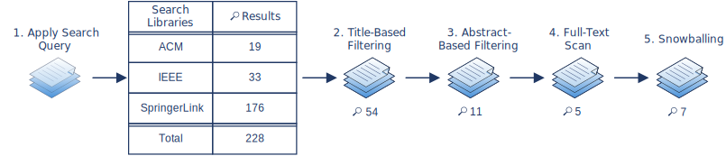

# First Systematic Literature Search Focusing on Existing Reviews

## Table of Contents
1. [General Information](#1-general-information)
2. [Searched Libraries](#2-searched-libraries)
    1. [Individual Libraries](#21-individual-libraries)
        1. [ACM](#ACM-search)
        2. [IEEE](#IEEE-search)
        3. [SpringerLink](#SpringerLink-search)
    2. [Joined Results](#22-joined-results)
3. [Selection of Suitable Literature](#3-selection-of-suitable-literature)
    1. [Title-Based Selection](#31-title-based-selection)
    2. [Abstract-Based Selection](#32-abstract-based-selection)
    3. [Full-Text Scan](#33-full-text-scan)
    4. [Snowballing](#34-snowballing)

-----------------------------------------------------

## 1. General Information

The following search strings were used to retrieve literature dealing with the desired topics.

<ins>Search string 1:</ins> (Abstract:(((modeling OR modelling) AND (language OR languages))) AND
Abstract:(cloud OR "service-oriented") AND
(Title:(review OR survey) OR Abstract:(review OR survey)))

<ins>Search string 2:</ins> (Abstract:((("domain-specific" OR "domain specific") AND
(language OR languages))) AND Abstract:(cloud OR "service-oriented") AND
(Title:(review OR survey) OR Abstract:(review OR survey)))

<ins>Search string 3:</ins> (Abstract:(("description language") OR ("description languages")) AND
Abstract:(cloud OR "service-oriented") AND
(Title:(review OR survey) OR Abstract:(review OR survey)))

Short summary of the overall procedure:




:calendar: Search date: 2022-01-24 until 2022-01-26

## 2. Searched Libraries

<!--<details><summary>Searched libraries</summary>-->
### 2.1 Individual Libraries

#### <a name="ACM-search">[ACM](https://dl.acm.org/)</a>

<details><summary><ins>Modeling language</ins></summary>

```
"query": { Abstract:(((modeling OR modelling) AND (language OR languages))) AND
Abstract:(cloud OR "service-oriented") AND
(Title:(review OR survey) OR Abstract:(review OR survey)) }
"filter": { ACM Content: DL }
```
:mag: Results: 18\
[ACM_Modeling_language_raw_results](ACM/S1_ACM_Modeling_language.bib)

</details>

<details><summary><ins>Domain-specific language</ins></summary>

```
"query": { Abstract:((("domain-specific" OR "domain specific") AND
(language OR languages))) AND Abstract:(cloud OR "service-oriented") AND
(Title:(review OR survey) OR Abstract:(review OR survey)) }
"filter": { ACM Content: DL }
```
:mag: Results: 1\
[ACM_Domain-specific_language_raw_results](ACM/S1_ACM_Domain-specific_language.bib)

</details>

<details><summary><ins>Description language</ins></summary>

```
"query": { Abstract:(("description language") OR ("description languages")) AND
Abstract:(cloud OR "service-oriented") AND
(Title:(review OR survey) OR Abstract:(review OR survey)) }
"filter": { ACM Content: DL }
```
:mag: Results: 2\
[ACM_Description_language_raw_results](ACM/S1_ACM_Description_language.bib)

</details>


Merged search results:\
[ACM_merged_raw_results](ACM/S1_ACM_merged_raw_results.bib)

&#8594; Result after removing duplicates: :mag: 19\
&nbsp;&nbsp;&nbsp;&nbsp;&nbsp;[ACM_merged_removed_duplicates](ACM/S1_ACM_merged_removed_duplicates.bib)

<!----------------------------------------------------------------------------->
<!---------------------------------IEEE---------------------------------------->
<!----------------------------------------------------------------------------->
#### <a name="IEEE-search">[IEEE](https://ieeexplore.ieee.org/Xplore/home.jsp)</a>

<details><summary><ins>Modeling language</ins></summary>

Modeling language - Abstract:

```
(("Abstract": modeling OR "Abstract": modelling) AND
("Abstract": language OR "Abstract": languages)) AND
("Abstract": cloud OR "Abstract": "service-oriented") AND
(("Abstract": review OR "Abstract": survey) OR ("Document Title":review OR  "Document Title":survey))
```
:mag: Results: 31\
[IEEE_Modeling_language_raw_results](IEEE/S1_IEEE_Modeling_language.bib)

</details>

<details><summary><ins>Domain-specific</ins></summary>

```
(("Abstract": domain-specific OR "Abstract": domain specific) AND
("Abstract": language OR "Abstract": languages)) AND
("Abstract": cloud OR "Abstract": "service-oriented") AND
(("Abstract": review OR "Abstract": survey) OR ("Document Title":review OR "Document Title":survey))
```
:mag: Results: 4\
[IEEE_Domain-specific_language_raw_results](IEEE/S1_IEEE_Domain-specific_language.bib)

</details>

</details>

<details><summary><ins>Description language</ins></summary>

```
("Abstract": "description language" OR "Abstract": "description languages") AND
("Abstract": cloud OR "Abstract": "service-oriented") AND
(("Abstract": review OR "Abstract": survey) OR ("Document Title":review OR "Document Title":survey))
```
:mag: Results: 3\
[IEEE_Description_language_raw_results](IEEE/S1_IEEE_Description_language.bib)

</details>

Merged search results:\
[IEEE_merged_raw_results](IEEE/S1_IEEE_merged_raw_results.bib)

&#8594; Result after removing duplicates: :mag: 33\
&nbsp;&nbsp;&nbsp;&nbsp;&nbsp;[IEEE_merged_removed_duplicates](IEEE/S1_IEEE_merged_removed_duplicates.bib)

<!----------------------------------------------------------------------------->
<!----------------------------SpringerLink------------------------------------->
<!----------------------------------------------------------------------------->
#### <a name="SpringerLink-search">[SpringerLink](https://link.springer.com/)</a>

The search terms are more specific than the [ACM](#ACM-search) and [IEEE](#IEEE-search) searches because SpringerLink allows only a full-text search.
However, the found literature remained too large to be analyzed despite the more specific search terms.
Therefore, it was decided to provide further restrictions for the title. The idea was that reviews concerning modeling languages for the cloud have most likely either _“survey“_ or _“review“_ in their title.
This was also considered in the searches on [ACM](#ACM-search) and [IEEE](#IEEE-search) but as an option between abstract <ins>or</ins> title.
In order to restrict the search not too much, the title restriction for SpringerLink was extended by another option for the title: _“cloud“_ in combination with _“language“_. Thus, the terms _"cloud" NEAR "language"_ and _"language" NEAR "cloud"_ were also specified for the title restriction.
Using the NEAR-operator (e.g. "cloud" NEAR "language") returns results where the search term on the left (in the example: "cloud") is within ten words of the word to the right (for the example: "language")[^1].    

[^1]: taken from https://link.springer.com/searchhelp, last accessed: 2022-01-27

Furthermore, SpringerLink only provides the option to export the search results as .csv-file.
Therefore, this .csv-file had to be transformed into a .bib-file.
For this, an R-Script was used to retrieve the DOIs from the .csv-files and save them in a .txt-file:

```Rscript
FoundLiterature <- read.csv("searchResults.csv", encoding = "UTF-8");
DOIs <- FoundLiterature["Item.DOI"]

write.table(DOIs,file="DOIs.txt", row.names = FALSE, quote=FALSE)
```
The R-Script can also be found in the following file: [Retrieve_DOIs_From_CSV](../R-Scripts/Retrieve_DOIs_From_CSV.R)

The received DOIs were then used with the tool [Zotero](https://www.zotero.org/) to create a .bib-file with the respective literature.


<details><summary><ins>Modeling language</ins></summary>

##### Advanced search &#8594; title: review

```
("modeling language" OR "modelling language" OR
"modeling languages" OR "modelling languages") AND
("cloud computing" OR "cloud-native" OR "cloud native" OR "service-oriented architecture")
```
<details><summary>Files for .csv to .bib</summary>

1. Export from SpringerLink: [CSV-Modeling_language_review_raw_results](SpringerLink/CSV-files/S1_SpringerLink_Modeling_language_review_raw_results.csv)
2. Retrieved DOIs: [DOIs_Modeling_language_review](SpringerLink/CSV-files/S1_SpringerLink_Modeling_language_review_DOIs.txt)
3. Result: [Bib-Modeling_language_review_raw_results](SpringerLink/S1_SpringerLink_Modeling_language_review_raw_results.bib)

</details>

:mag: Results: 69

##### Advanced search &#8594; title: survey

```
("modeling language" OR "modelling language" OR
"modeling languages" OR "modelling languages") AND
("cloud computing" OR "cloud-native" OR "cloud native" OR "service-oriented architecture")
```
<details><summary>Files for .csv to .bib</summary>

1. Export from SpringerLink: [CSV-Modeling_language_survey_raw_results](SpringerLink/CSV-files/S1_SpringerLink_Modeling_language_survey_raw_results.csv)
2. Retrieved DOIs: [DOIs_Modeling_language_survey](SpringerLink/CSV-files/S1_SpringerLink_Modeling_language_survey_DOIs.txt)
3. Result: [Bib-Modeling_language_survey_raw_results](SpringerLink/S1_SpringerLink_Modeling_language_survey_raw_results.bib)

</details>

:mag: Results: 43

##### Advanced search &#8594; title: "cloud" NEAR "language"

```
("modeling language" OR "modelling language" OR
"modeling languages" OR "modelling languages") AND
("cloud computing" OR "cloud-native" OR "cloud native" OR "service-oriented architecture")
```
<details><summary>Files for .csv to .bib</summary>

1. Export from SpringerLink: [CSV-Modeling_language_cloud-near-language_raw_results](SpringerLink/CSV-files/S1_SpringerLink_Modeling_language_cloud-near-language_raw_results.csv)
2. Retrieved DOIs: [DOIs_Modeling_language_cloud-near-language](SpringerLink/CSV-files/S1_SpringerLink_Modeling_language_cloud-near-language_DOIs.txt)
3. Result: [Bib-Modeling_language_cloud-near-language_raw_results](SpringerLink/S1_SpringerLink_Modeling_language_cloud-near-language_raw_results.bib)

</details>
:mag: Results: 2

##### Advanced search &#8594; title: "language" NEAR "cloud"

```
("modeling language" OR "modelling language" OR
"modeling languages" OR "modelling languages") AND
("cloud computing" OR "cloud-native" OR "cloud native" OR "service-oriented architecture")
```
<details><summary>Files for .csv to .bib</summary>

1. Export from SpringerLink: [CSV-Modeling_language_language-near-cloud_raw_results](SpringerLink/CSV-files/S1_SpringerLink_Modeling_language_language-near-cloud_raw_results.csv)
2. Retrieved DOIs: [DOIs_Modeling_language_language-near-cloud](SpringerLink/CSV-files/S1_SpringerLink_Modeling_language_language-near-cloud_DOIs.txt)
3. Result: [Bib-Modeling_language_language-near-cloud_raw_results](SpringerLink/S1_SpringerLink_Modeling_language_language-near-cloud_raw_results.bib)

</details>
:mag: Results: 3

</details>

<details><summary><ins>Domain-specific language</ins></summary>

##### Advanced search &#8594; title: review

```
("domain-specific language" OR "domain specific language" OR
"domain-specific languages" OR "domain specific languages") AND
("cloud computing" OR "cloud-native" OR "cloud native" OR
"service-oriented architecture")
```
<details><summary>Files for .csv to .bib</summary>

1. Export from SpringerLink: [CSV-Domain-specific_language_review_raw_results](SpringerLink/CSV-files/S1_SpringerLink_Domain-specific_language_review_raw_results.csv)
2. Retrieved DOIs: [DOIs_Domain-specific_language_review](SpringerLink/CSV-files/S1_SpringerLink_Domain-specific_language_review_DOIs.txt)
3. Result: [Bib-Domain-specific_language_review_raw_results](SpringerLink/S1_SpringerLink_Domain-specific_language_review_raw_results.bib)

</details>

:mag: Results: 17

##### Advanced search &#8594; title: survey

```
("domain-specific language" OR "domain specific language" OR
"domain-specific languages" OR "domain specific languages") AND
("cloud computing" OR "cloud-native" OR "cloud native" OR
"service-oriented architecture")
```
<details><summary>Files for .csv to .bib</summary>

1. Export from SpringerLink: [CSV-Domain-specific_language_survey_raw_results](SpringerLink/CSV-files/S1_SpringerLink_Domain-specific_language_survey_raw_results.csv)
2. Retrieved DOIs: [DOIs_Domain-specific_language_survey](SpringerLink/CSV-files/S1_SpringerLink_Domain-specific_language_survey_DOIs.txt)
3. Result: [Bib_Domain-specific_language_survey_raw_results](SpringerLink/S1_SpringerLink_Domain-specific_language_survey_raw_results.bib)

</details>

:mag: Results: 22

##### Advanced search &#8594; title: "cloud" NEAR "language"

```
("domain-specific language" OR "domain specific language" OR
"domain-specific languages" OR "domain specific languages") AND
("cloud computing" OR "cloud-native" OR "cloud native" OR
"service-oriented architecture")
```
:mag: Results: 0

##### Advanced search &#8594; title: "language" NEAR "cloud"

```
("domain-specific language" OR "domain specific language" OR
"domain-specific languages" OR "domain specific languages") AND
("cloud computing" OR "cloud-native" OR "cloud native" OR
"service-oriented architecture")
```
:mag: Results: 0

</details>

<details><summary><ins>Description language</ins></summary>

##### Advanced search &#8594; title: review

```
(" description language" OR "description languages") AND
("cloud computing" OR "cloud-native" OR "cloud native" OR "service-oriented architecture")
```
<details><summary>Files for .csv to .bib</summary>

1. Export from SpringerLink: [CSV-Description_language_review_raw_results](SpringerLink/CSV-files/S1_SpringerLink_Description_language_review_raw_results.csv)
2. Retrieved DOIs: [DOIs_Description_language_review](SpringerLink/CSV-files/S1_SpringerLink_Description_language_review_DOIs.txt)
3. Result: [Bib-Description_language_review_raw_results](SpringerLink/S1_SpringerLink_Description_language_review_raw_results.bib)

</details>

:mag: Results: 31

##### Advanced search &#8594; title: survey

```
("description language" OR "description languages") AND
("cloud computing" OR "cloud-native" OR "cloud native" OR "service-oriented architecture")
```
<details><summary>Files for .csv to .bib</summary>

1. Export from SpringerLink: [CSV-Description_language_survey_raw_results](SpringerLink/CSV-files/S1_SpringerLink_Description_language_survey_raw_results.csv)
2. Retrieved DOIs: [DOIs_Description_language_survey](SpringerLink/CSV-files/S1_SpringerLink_Description_language_survey_DOIs.txt)
3. Result: [Bib-Description_language_survey_raw_results](SpringerLink/S1_SpringerLink_Description_language_survey_raw_results.bib)

</details>
:mag: Results: 37

##### Advanced search &#8594; title: "cloud" NEAR "language"

```
(" description language" OR "description languages") AND
("cloud computing" OR "cloud-native" OR "cloud native" OR "service-oriented architecture")
```
<details><summary>Files for .csv to .bib</summary>

1. Export from SpringerLink: [CSV-Description_language_cloud-near-language_raw_results](SpringerLink/CSV-files/S1_SpringerLink_Description_language_cloud-near-language_raw_results.csv)
2. Retrieved DOIs: [DOIs_Description_language_cloud-near-language](SpringerLink/CSV-files/S1_SpringerLink_Description_language_cloud-near-language_DOIs.txt)
3. Result: [Bib-Description_language_cloud-near-language_raw_results](SpringerLink/S1_SpringerLink_Description_language_cloud-near-language_raw_results.bib)

</details>
:mag: Results: 1

##### Advanced search &#8594; title: "language" NEAR "cloud"

```
(" description language" OR "description languages") AND
("cloud computing" OR "cloud-native" OR "cloud native" OR "service-oriented architecture")
```
:mag: Results: 0

</details>


Merged search results:\
[SpringerLink_merged_raw_results](SpringerLink/S1_SpringerLink_merged_raw_results.bib)


&#8594; Result after removing duplicates: :mag: 176\
&nbsp;&nbsp;&nbsp;&nbsp;&nbsp;[SpringerLink_merged_removed_duplicates](SpringerLink/S1_SpringerLink_merged_removed_duplicates.bib)

### 2.2 Joined Results

The search results from all three libraries were merged and existing duplicates removed.
However, no duplicates were found in this merge.

&#8594; Merged search results: :mag: 228\
&nbsp;&nbsp;&nbsp;&nbsp;&nbsp;[Total_search-results_merged](S1_0_Total_search-results_merged.bib)

## 3. Selection of Suitable Literature

In order to find suitable literature to determine which ADLs are worth evaluating, the following steps were conducted.
For this, the focus lies on existing reviews of modeling languages (preferably in the cloud or service-oriented domain) to select the ones worth evaluating.

### 3.1 Title-Based Selection
:x: Exclusion Criteria:
   - [ ] Meta entries for conference proceedings
   - [ ] Keynotes and invited-talks
   - [ ] Surveys or Reviews not related to modeling languages, for example regarding service discovery, virtual reality or machine learning
   - [ ] Unrelated topics, for instance regarding Natural Language Processing (NLP), security, smart home/village or artificial intelligence-related topics like neural networks,
   - [ ] The terms "model" or "modeling" appear in a different and unrelated context, such as a review model, data model or trust modeling
<!--
      - Pricing
      - Geographic information systmes
      - not cloud related
      - service discovery/ service broker
      - software-defined network controllers
      - AI (neural networks etc.)
      - too specific directions (nature environment, NLP systems, blockchain)
      - security risk assessment methods
      - smart homes / smart village/city
      - Big Data
      - IoT
      - Virtual Reality
      - too general, not focusing on architecture or language?; no aspect of architecture
      - other types of modeling (verification)
-->


:heavy_check_mark: Inclusion criteria:
  - [x] Reference to a model, to modeling or modeling language(s)\
      &#8594; exceptions see above
  - [x] Paper topic not evident from the title, for example "Literature review"
  - [x] Reference to specific modeling languages
  - [x] General reference to software architecture, too general to be excluded

&#8594; The result after filtering based on the title: :mag: 54\
&nbsp;&nbsp;&nbsp;&nbsp;&nbsp;[1_Title_Filtering_results](S1_1_Title_filtering_results.bib)

### 3.2 Abstract-Based Selection
:x: Exclusion Criteria:
  - [ ] Only focusing on one modeling language and not reviewing others in addition
  - [ ] The term "model" refers to a different and not relevant context such as deployment metamodel or quality models
  - [ ] Type of modeling does not refer to architecture, for example lifecycle modeling, modeling transformation or (business) process modeling
  - [ ] Dealing with a different, unrelated context
  - [ ] Focus too narrow or specific, for example manufacturing process, machine learning or security aspects


:heavy_check_mark: Inclusion Criteria:
  - [x] Reference to reviewing several architecture languages\
      &#8594; synonyms like service description language or survey are also included\
      &#8594; synonyms like examine or analyze are also included\
      (&#8594; preferably cloud or service-oriented context)
  - [x] General reference to survey and software architecture, abstract still too general to be excluded (or mentions modeling to some extent?)
  - [x] Reference to reviewing modeling languages in cloud context


&#8594; The result after filtering based on the abstract: :mag: 11\
&nbsp;&nbsp;&nbsp;&nbsp;&nbsp;[2_Abstract_Filtering_results](S1_2_Abstract_Filtering_results.bib)

### 3.3 Full-Text Scan
:x: Exclusion Criteria:
  - [ ] No actual review of modeling languages, for example simply a listing of existing ones
  - [ ] Review criteria and area too specific to be included or relevant

:heavy_check_mark: Inclusion Criteria:
  - [X] Actual review of several modeling languages regarding a range of different criteria
  - [X] Considered area and criteria are relevant to cloud domain

<details><summary>Removal Reasoning per paper</summary>

_Bibtex-Keys_ refer to the [2_Abstract_Filtering_results](S1_2_Abstract_Filtering_results.bib) file.\
&#8594; The previous _citationkeys_ have been adapted for standardization purposes but can be found in the _comment_ field.

| __Bibtex-Key__ | <div align="center">__Title__</div> | <div align="center">__Removal Reason__</div>
|:----------------------------:|:-------------------|:--------------------------|
| Chen2010 | A Ten-Year Survey of Software Architecture | Analysis of the advances regarding software architectures. For this, the authors considered some architecture description languages (ADLs), the design and evolution of software architecture design and a short presenation of the service-oriented architecture (SOA).<ul><li>Presentation and short comparison of five ADLs<br> &#8594; No consideration of cloud or service-related aspects<br> &#8594; Very few general aspects were considered like application scope or supporting tools</li></ul> |
| Liu2020 | A Survey of Model-Driven Techniques and Tools for Cyber-Physical Systems | Analyzation of state-of-the-art model-driven approaches in the context of cyber-physical systems (CPS). For this, model-based systems engineering techniques/ tools were considered and compared. <ul><li>Focus lies on analyzing the different ADLs regarding CPS aspects like physical plant or controller as components<br> &#8594; Too specific aspects analyzed </li><li>Short general analysis<br> &#8594; Too few aspects with not enough detail to be considered </li></ul> |
| Mary2011 | Survey and Comparison of Frameworks in Software Architecture | Short description of several architectural frameworks and analyzing different aspects of them. <ul><li>Focus lies on analyzing the different frameworks<br> &#8594; No actual or detailed review of modeling languages</li></ul>|
| Mohsin2018 | A review and future directions of SOA-based software architecture modeling approaches for System of Systems | Service-oriented architecture in the context of software architecture modeling for System of Systems (SoS). The review analyzes different modeling languages typical for software-oriented architecture. <ul><li>Analyzation of SOA typical modeling languages<br> &#8594; Desired cloud relation is missing</li><li>Used analyzation aspects very general<br> &#8594; No cloud specific aspects considered </li></ul> |
| Teka2012 | A Systematic Literature Review on Service Description Methods | A systematic literature review regarding service description languages while analyzing their strengths and weaknesses. <ul><li>Focus lies solely on service description aspects<br> &#8594; No review or analysis regarding architecture related aspects</li><li>Only statements regarding modeling of individual services<br> &#8594; Not considering the system as a whole</li></ul>|
| Zaafouri2021 | Systematic Literature Review on Service Oriented Architecture Modeling | A systematic literature review to identify typical modeling methods for SOA-based architectures. <ul><li>Simply a literature review regarding the techniques that have been used to model a service-oriented architecture (SOA)<br> &#8594; No actual or detailed review of the modeling languages</li><li>Not focusing on modeling languages for solely architecture related specifics but also considering e.g. behavioural related<br> &#8594; Many are not relevant for the intended use case</li></ul>|

</details


&#8594; The result after filtering based on full-text scan: :mag: 5\
&nbsp;&nbsp;&nbsp;&nbsp;&nbsp;[3_Full-text_scan_results](S1_3_Full-text_scan_results.bib)

### 3.4 Snowballing

As the last step, the Snowballing technique was chosen to obtain more relevant literature potentially.
This approach also allows a certain quality to check whether most relevant papers have already been retrieved
In order to achieve this, both backward snowballing as well as forward snowballing were carried out.

#### Backward Snowballing

For the backward approach, the references of all identified reviews from the [Full-text Scan](#33-full-text-scan) are checked.
Especially, the literature mentioned in the respective _related work_ section is considered in more detail.
However, this analysis showed that already all relevant reviews were retrieved.

#### Forward Snowballing

On the other hand, the search engine Google Scholar[^2] was used for the forward approach.
Google Scholar allows investigating papers that cited the searched paper.
With this approach, two papers that cite the paper by [Bergmayr2014] could be identified as relevant:

- _Towards a Lightweight Multi-Cloud DSL for Elastic and Transferable Cloud-native Applications_ [Quint2018]
- _A Framework for Modeling Cloud Infrastructures and User Interactions_ [Bernal2019]     

[^2]: https://scholar.google.com/, last accessed: 2022-01-31


These two papers also include reviews concerning some architecture modeling languages for cloud applications while considering cloud-related aspects.
However, these reviews are shorter or considering more specific aspects of the cloud.

&#8594; The Bibtex-file that includes the final selection of relevant literature: :mag: 7\
&nbsp;&nbsp;&nbsp;&nbsp;&nbsp;[4_Final_Selection](S1_4_Final_Selection.bib)
