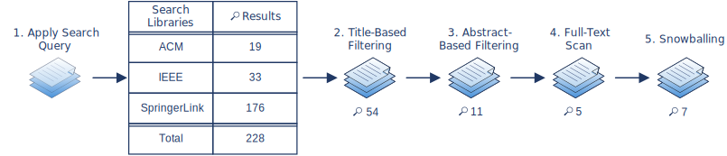

# Methodology: Selecting the Architecture Description Languages

## Table of Contents
1. [General Information](#1-general-information)
2. [First Systematic Literature Search: Finding ADL Reviews](#first-literature-review)
    1. [Finding ADL Reviews](#21-finding-aDL-reviews)
    2. [Selection of Suitable Architecture Description Languages](#review-based-selection-of-suitable-architecture-description-languages)
3. [Second Systematic Literature Search: Finding Recent ADLs](#second-literature-review)
    1. [Finding Recent ADLs](#31-finding-recent-aDLs)
    2. [Selection of Suitable Architecture Description Languages](#recent-based-selection-of-suitable-architecture-description-languages)
4. [Final ADL Selection Result](#4-final-aDL-selection-result)

-----------------------------------------------------

## 1. General Information

The approach to select relevant modeling languages is described in detail below.
A systematic literature search was conducted to determine relevant modeling languages and possible criteria for later evaluating the chosen languages.\
First, the [systematic literature search](#first-literature-review) focused on existing reviews on modeling languages in the context of services and the cloud.
However, mainly older reviews were found and no recent ones (the last review dates from 2019).
Consequently, the reviews mainly consider older modeling languages whose relevance is not necessarily longer given today.
Therefore, a [second systematic literature search](#second-literature-review) was conducted to find recently proposed or relevant modeling languages in the context of the cloud or microservices.

After each literature search, the selected modeling languages are mentioned with their respective selection reason(s).
Additionally, the general exclusion reasons are also listed.

The final result with a summarization of the selected modeling languages can be found in the [Final ADL Selection Result](#4-final-aDL-selection-result) section.

## 2. <a name="first-literature-review">First Systematic Literature Search: Finding Reviews</a>

The first literature search focused on finding existing reviews on modeling languages in the context of services and the cloud.

### 2.1 Finding ADL Reviews

A description of the stepwise performed systematic literature search can be found here: [1_Review_Search](1_Review_Search)

&#8594; The Bibtex-file that includes the final selection of relevant literature: :mag: 7\
&nbsp;&nbsp;&nbsp;&nbsp;&nbsp;[4_Final_Review_Selection](1_Review_Search/S1_4_Final_Selection.bib)

Short summary of the overall procedure:

:calendar: Search date: 2022-01-24 until 2022-01-26

### 2.2 <a name="review-based-selection-of-suitable-architecture-description-languages">Selection of Suitable Architecture Description Languages</a>

The information gained from the reviews is used to select appropriate ADLs for the evaluation.

:x: Exclusion Criteria:
- Identified domain does not include cloud services
- Language covers only business-related aspects and not technical ones
- Focus lies mainly on the provider of a cloud environment instead of the user
- Language for platform-specific models
- Focus lies only on runtime aspects (&#8594; Quality Model considers design time)
- Language objective focuses solely on aspects regarding, for example, service level agreement, service discovery or selection
- Focus lies on one specific type of cloud environment/ delivery model (e.g. PaaS)
- The language's intended users do not include application developers but focus on application user perspective
- Application components cannot be considered when interactions between a cloud service and the cloud application are modeled

:heavy_check_mark: Selection Criteria:
- Language is still relevant: publishing of new versions, further paper publications, tool support is being further developed

Result:

| __Modeling Language__ | 
__Selection Reasons__
 |
|:----------------------------:|:-------------------|
| TOSCA |<ul><li>Analyzed by all detailed reviews [Sun2012, Bergmayr2014, Bergmayr2018, Nawaz2019] as well as considered by the shorter/ more specific reviews [Quint2018, Bernal2019,  Kritikos2019]</li><li>[OASIS](https://www.oasis-open.org/committees/tc_home.php?wg_abbrev=tosca) standard fors life-cycle management and cloud application representation</li><li>Last version was published in 2020[^1] and is still the subject of many current papers</li></ul>|
| CAMEL |<ul><li>Considered by the shorter/more specific reviews [Quint2018, Kritikos2019]</li><li>Also mentioned by [Bergmayr2018], however not analyzed due to its ongoing development back then</li><li>Exploits model at design- as well as run-time<\li><li>Provides Multi-Cloud potential</li><li>Last paper was published in 2019[^2]</li><li>Code still receives updates [^3]</li></ul>|
| CloudML (with CloudMF) |<ul><li>Considered by the detailed reviews [Bergmayr2014, Bergmayr2018]</li><li>Last paper published in 2018[^5]</li><li>Also allows runtime considerations</li></ul>|

[^1]: https://www.oasis-open.org/news/announcements/tosca-simple-profile-in-yaml-v1-3-oasis-standard-published/, last accessed: 2022-02-02

[^2]: Achilleos, A.P., Kritikos, K., Rossini, A. et al. The cloud application modelling and execution language. J Cloud Comp 8, 20 (2019). https://doi.org/10.1186/s13677-019-0138-7

[^3]: https://bitbucket.7bulls.eu/projects/MEL/repos/camel/commits?until=refs%2Fheads%2Fcamel-3.0.2-alpha&merges=include, Commit ID: [33edfe5f56f](https://bitbucket.7bulls.eu/projects/MEL/repos/camel/commits/33edfe5f56f027037241fcb19e2a1fecafc7e068), last accessed: 2022-02-02

[^5]:  Ferry, N., Chauvel, F., Song, H., Rossini, A., Lushpenko, M., & Solberg, A. (2018, May). CloudMF: Model-Driven Management of Multi-Cloud Applications. In ACM Transactions on Internet Technology (TOIT), 18(2), (pp. 1-24). https://doi.org/10.1145/3125621

Since the exclusion criteria apply to the other languages, a second systematic literature search was conducted to find further relevant modeling languages.

## 3. <a name="second-literature-review">Second Systematic Literature Search: Finding Recent ADLs</a>

The second systematic literature search was performed to find further recently proposed or relevant modeling languages in the context of the cloud or microservices.

### 3.1 Finding Recent ADLs

A description of the stepwise performed systematic literature search can be found here: [2_Recent_ADLs_Search](2_Recent_ADLs_Search)

&#8594; The Bibtex-file that includes the final selection of relevant literature: :mag: X\
&nbsp;&nbsp;&nbsp;&nbsp;&nbsp;[4_Final_Recent_ADL_Selection](2_Recent_ADLs_Search/S2_4_Final_Selection.bib)

Short summary of the overall procedure:

:calendar: Search date: 2022-02-02

### 3.2 <a name="recent-based-selection-of-suitable-architecture-description-languages">Selection of Suitable Architecture Description Languages</a>

For the selection aspects like the language's relevant and main focus/scope were considered.

:x: Exclusion Criteria:
- Too restricted on specific aspects
- Another approach is based on it
- Based on another language which is already being evaluated

:heavy_check_mark: Selection Criteria:
- Language is still relevant: publishing of new versions, further paper publications, tool support is being further developed
- Enough explanatory and descriptive papers or documentation for modeling language available
- Ideally, supportive tools provided

Result:

| __Modeling Language__ | 
__Selection Reasons__
 |
|:----------------------------:|:-------------------|
| LEMMA |<ul><li>Mentioned in many recent papers [Giallorenzo2021, Rademacher2019a, Rademacher2020, Rademacher2021, Sorgalla2020, Sorgalla2020a, Trebbau2021]</li><li>Extensive amount of research already exists</li><li>Relevance is given: further papers are being published, and its Github page receives still updates</li></ul>|
| Context Mapper |<ul><li>Relevance is given: last papers have just recently been published, last version was recently published and its Github page receives still updates</li><li>uses Domain-driven Design (DDD) perspective</li><li>detailed but compact and up-to-date online documentation</li></ul>|

## 4. Final ADL Selection Result

The following table summarizes the final selection of modeling languages to be evaluated in the further course of the master thesis.
Additionally, a non-exhaustive list of the primary reference(s) for the individual modeling language is provided.

| __Modeling Language__ | 
__Main Reference__
 |
|:----------------------------:|:-------------------|
| TOSCA | [OASIS TOSCA](https://www.oasis-open.org/committees/tc_home.php?wg_abbrev=tosca)    Binz, T., Breitenbücher, U., Kopp, O., & Leymann, F. (2014). TOSCA: Portable Automated Deployment and Management of Cloud Applications. _In Advanced Web Services_ (pp. 527-549). Springer. https://doi.org/10.1007/978-1-4614-7535-4_22 |
| CAMEL | Achilleos, A. P., Kritikos, K., Rossini, A., Kapitsaki, G. M., Domaschka, J., Orzechowski, M., ... & Papadopoulos, G. A. (2019). The Cloud Application Modelling and Execution Language. _Journal of Cloud Computing, 8(1),_ (pp. 1-25). https://doi.org/10.1186/s13677-019-0138-7 |
| CloudML (with CloudMF) | Ferry, N., Rossini, A., Chauvel, F., Morin, B., & Solberg, A. (2013, June). Towards model-driven provisioning, deployment, monitoring, and adaptation of multi-cloud systems. _In 2013 IEEE Sixth International Conference on cloud computing_ (pp. 887-894). IEEE. https://doi.org/10.1109/CLOUD.2013.133    Ferry, N., Song, H., Rossini, A., Chauvel, F., & Solberg, A. (2014, December). CloudMF: Applying MDE to Tame the Complexity of Managing Multi-Cloud Applications. _In 2014 IEEE/ACM 7th International Conference on Utility and Cloud Computing_ (pp. 269-277). IEEE. https://doi.org/10.1109/UCC.2014.36    Ferry, N., Chauvel, F., Song, H., Rossini, A., Lushpenko, M., & Solberg, A. (2018, May). CloudMF: Model-Driven Management of Multi-Cloud Applications. _In ACM Transactions on Internet Technology (TOIT), 18(2),_ (pp. 1-24). https://doi.org/10.1145/3125621 |
| LEMMA | [LEMMA official Github page](https://github.com/SeelabFhdo/lemma/)[^4]    Rademacher, F., Sorgalla, J., Wizenty, P., Sachweh, S., & Zündorf, A. (2020). Graphical and Textual Model-Driven Microservice Development. _In Microservices_ (pp. 147-179). Springer, Cham. https://doi.org/10.1007/978-3-030-31646-4_7    Rademacher, F., Sachweh, S., & Zündorf, A. (2020, August). Deriving microservice code from underspecified domain models using DevOps-enabled modeling languages and model transformations. _In 2020 46th Euromicro Conference on Software Engineering and Advanced Applications (SEAA)_ (pp. 229-236). IEEE. https://doi.org/10.1109/SEAA51224.2020.00047    Rademacher, F., Sorgalla, J., Wizenty, P., & Trebbau, S. (2021). Towards Holistic Modeling of Microservice Architectures Using LEMMA. _In Companion Proceedings of the 15th European Conference on Software Architecture 2021. CEUR-WS. [http://ceur-ws.org/Vol-2978/mde4sa-paper2.pdf](http://ceur-ws.org/Vol-2978/mde4sa-paper2.pdf)[^4]    more literature by the authors can be found in their Github's [Science](https://github.com/SeelabFhdo/lemma/#science) section |
| Context Mapper | [Official Context  Mapper Website](https://contextmapper.org/)[^4]   Kapferer, S., & Zimmermann, O. (2020). Domain-Specific Language and Tools for Strategic Domain-Driven Design, Context Mapping and Bounded Context Modeling. _In Proceedings of the 8th International Conference on Model-Driven Engineering and Software Development (MODELSWARD)_ (pp. 299-306). SCITEPRESS. https://doi.org/10.5220/0008910502990306    Kapferer, S., & Zimmermann, O. (2020, September). Domain-driven service design. _In Symposium and Summer School on Service-Oriented Computing (pp. 189-208)_. Springer, Cham. https://doi.org/10.1007/978-3-030-64846-6_11 |

[^4]: last accessed: 2022-02-04
