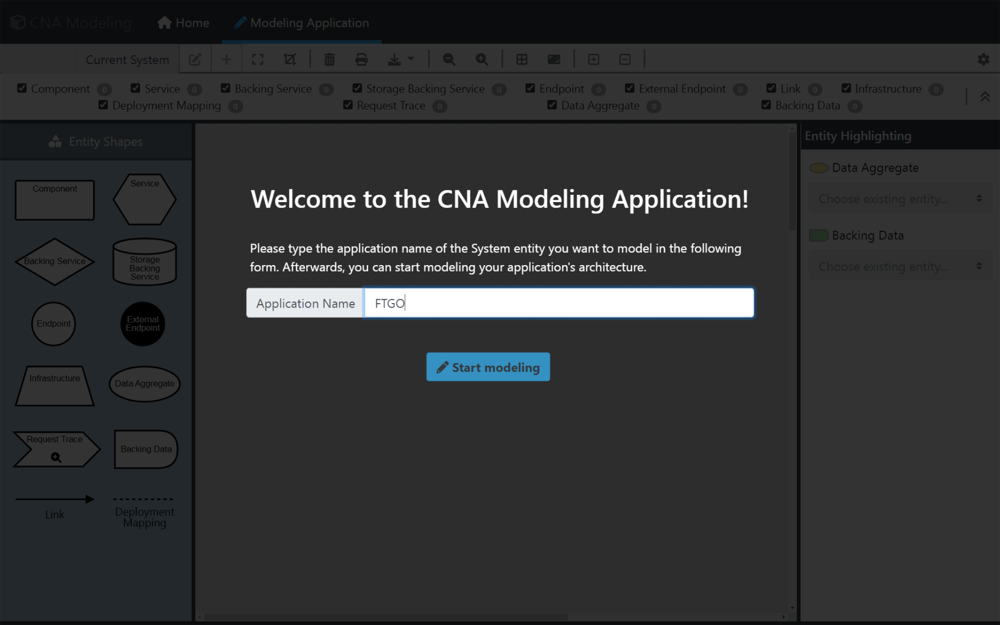

Title: Home
Date: 2022
# Providing Tooling Support for Modeling Cloud-Native Application Architectures

The Accompanying repository for the paper “An Evaluation of Modeling Options for Cloud-native Application Architectures to Enable Quality Investigations”.

__This documentation is currently still under development.__

All the following topics focus in some way on the cloud-native quality model as introduced in the paper [“Towards a Quality Model for Cloud-native Applications”](https://doi.org/10.1007/978-3-031-04718-3_7) and the [CNA Quality Model Repository](https://github.com/r0light/cna-quality-model/tree/0.1).

---------------------------------------------------------

## 1. Quality Model For Cloud-Native Applications: Product Factor to Entity Mapping

The concrete mapping of each product factor to the individual entities can be found here: [Product Factor - Entity Mapping](CNA_Mapping/index.md)

## 2. ADL Search & Selection

The process for the systematic literature search that led to the selection of the architecture description languages that are being analyzed can be found here:

- [X] [Literature Search Overview](ADL_Search/index.md)
- [X] [Review Literature Search](ADL_Search/1_Review_Search.md)
- [X] [Recent ADLs Literature Search](ADL_Search/2_Recent_ADLs_Search.md)

## 3. TOSCA

A detailed review of the five ADLs - [TOSCA](https://www.oasis-open.org/committees/tc_home.php?wg_abbrev=tosca), [CloudML](https://github.com/SINTEF-9012/cloudml), [CAMEL](https://camel-dsl.org/), [LEMMA](https://github.com/SeelabFhdo/lemma) and [Context Mapper](https://contextmapper.org/) - led to the selection of TOSCA to model architectures for the quality model. However, an extension is required such that all proposed entities of the quality model can be represented. Therefore, besides providing the proposed extension, Richardson’s [FTGO Application]( https://github.com/microservices-patterns/ftgo-application) was modeled using the original as well as the extended TOSCA version to identify further requirements.   

### 3.1 TOSCA: FTGO Modeling

The mapping of FTGO elements to the quality model entities, as well as the modeling itself, can be found here: [TOSCA - FTGO Modeling](ToscaModeling)

- [X] [mapping FTGO to quality model entities](ToscaModeling/index.md)
- [X] [modeling with original version](ToscaModeling/OriginalTosca/index.md)
- [X] [modeling with extended version](ToscaModeling/ExtendedTosca/index.md)

### 3.2 TOSCA: Extension Proposal

The detailed definition of the proposed extension for TOSCA can be found here: [TOSCA Extension](Extension/index.md)

## 4. Web-based Tooling Support

In order to provide web-based tooling support, a review of existing JS modeling libraries was conducted as well as a prototypical application was developed.

### 4.1 JS Modeling Library Search & Selection

A description of the Google and Github search leading to the selection of the Javascript libraries that are being analyzed can be found here: [JS Modeling Library Selection Methodology](Modeling_Framework_Search/index.md)

### 4.2 Web-Based Modeling Application

The code of the prototypical web-based modeling application using the open-source [JointJS](https://www.jointjs.com/) modeling library can be found here: [JS Code](https://github.com/KarolinDuerr/MA-CNA-ModelingSupport/tree/main/Modeling_WebApp). It also includes a description of how to run the prototype.

An example of what the prototype looks like:

<figure markdown>
  
  <figcaption>An example of the WebApp prototype</figcaption>
</figure>
